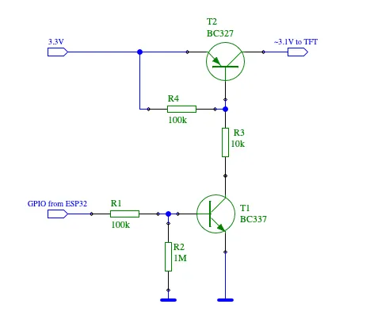

## Realizations

- GPIO9 is a digital I/O pin. By default, this pin has an internal weak pull-up resistor (WPU) enabled, both at reset and after reset.
This is documented in the Pin Overview tables. (APPENDIX A: ESP32-C6 Consolidated Pin Overview on page 77, 78)

So you cant use this IO pin to power down the Display. 

According to the Displays datasheet the current consumption of in total is about 30mA.
So I might not be able to power the display using a single GPIO pin in normal drive mode. A Pin in High Drive mode should be fine, tho.


### What are my possibilities?
Summarize what is possible to do:

#### Using a GPIO Pin to Power the Display 
- Use a single GPIO Pin in High Current Drive Mode (40mA) to power the entire display. It will automatically turn off when the esp goes to deep Sleep.

#### Enable Display Voltage with PMOS
- Use a PMOS Transistor for Enabling/Disabling the Power to the Display. Powered from the 3V Bus of the ESP.
- The PMOS is driven be a either directly a GPIO Pin or via a NPN Transistor. Using an additional transistor allows that the 

- Downsite:
    - Additional Components (1PMOS + 1NPN needed)

Could also be implemented with the trick that the GPIO Pin state is held during deep sleep. That way the PMOS Gate could be held HIGH during DeepSleep, keeping the Display OFF.

#### GPIO Hold during Deep Sleep
- Use a regular GPIO Pin connected to the LIT Pin of the Display and enable **gpio_deep_sleep_hold** 
  - The Hold generally works and can be used. However the PIN still cant source enough current.
  - For that an NMOS Transistor would be required to pull the LIT Pin down.
  - Downsite:
    - Current Flow between the LIT Pin and GNG during the DeepSleep phase
    - Additional Components (1 NMOS) needed


### Figure out another way how to completly disable the 3V voltage line during deep Sleep
- What I dont really like is that the 3V output of the ESP32 C6 Feather stays at 3V even during deep Sleep.


### Desolder the Pull Up resistor and solder a Pull Down 
This is by far the best solution of all of them. Solve the issue right from the origin!
The Downsite is that manual soldering was required but no additional components and no software hacks needed.


## Common Problems I encounter
When trying to compile:
> Error: This board doesn't support arduino framework!

This happens to me once when I uninstalled the libraries and installed them again
```shell
pio pkg uninstall
```

The cause is that the official
```
davidwitulla@MacBook-Pro-5 ESP32_BME280 % pio boards espressif32 | grep -i c6  
esp32-c6-devkitc-1                   ESP32C6  160MHz       8MB      320KB   Espressif ESP32-C6-DevKitC-1
esp32-c6-devkitc-1                   ESP32C6  160MHz       8MB      320KB   Espressif ESP32-C6-DevKitC-1
esp32-c6-devkitm-1                   ESP32C6  160MHz       4MB      320KB   Espressif ESP32-C6-DevKitM-1
esp32-c6-devkitm-1                   ESP32C6  160MHz       4MB      320KB   Espressif ESP32-C6-DevKitM-1
seeed_xiao_esp32c6                   ESP32C6  160MHz       4MB      320KB   Seeed Studio XIAO ESP32C6
cezerio_dev_esp32c6                  ESP32C6  160MHz       4MB      320KB   cezerio dev ESP32C6
cezerio_mini_dev_esp32c6             ESP32C6  160MHz       4MB      320KB   cezerio mini dev ESP32C6
```
To list all available Adafruit Boards

```
davidwitulla@MacBook-Pro-5 ESP32_BME280 % pio boards espressif32 | grep -i adafruit
featheresp32                         ESP32    240MHz       4MB      320KB   Adafruit ESP32 Feather
featheresp32-s2                      ESP32S2  240MHz       4MB      320KB   Adafruit ESP32-S2 Feather Development Board
adafruit_feather_esp32_v2            ESP32    240MHz       8MB      320KB   Adafruit Feather ESP32 V2
adafruit_feather_esp32s2             ESP32S2  240MHz       4MB      320KB   Adafruit Feather ESP32-S2
adafruit_feather_esp32s2_reversetft  ESP32S2  240MHz       4MB      320KB   Adafruit Feather ESP32-S2 Reverse TFT
adafruit_feather_esp32s2_tft         ESP32S2  240MHz       4MB      320KB   Adafruit Feather ESP32-S2 TFT
adafruit_feather_esp32s3             ESP32S3  240MHz       4MB      320KB   Adafruit Feather ESP32-S3 2MB PSRAM
adafruit_feather_esp32s3_nopsram     ESP32S3  240MHz       8MB      320KB   Adafruit Feather ESP32-S3 No PSRAM
adafruit_feather_esp32s3_reversetft  ESP32S3  240MHz       4MB      320KB   Adafruit Feather ESP32-S3 Reverse TFT
adafruit_feather_esp32s3_tft         ESP32S3  240MHz       4MB      320KB   Adafruit Feather ESP32-S3 TFT
adafruit_funhouse_esp32s2            ESP32S2  240MHz       4MB      320KB   Adafruit FunHouse
adafruit_itsybitsy_esp32             ESP32    240MHz       8MB      320KB   Adafruit ItsyBitsy ESP32
adafruit_magtag29_esp32s2            ESP32S2  240MHz       4MB      320KB   Adafruit MagTag 2.9
adafruit_matrixportal_esp32s3        ESP32S3  240MHz       8MB      320KB   Adafruit MatrixPortal ESP32-S3
adafruit_metro_esp32s2               ESP32S2  240MHz       4MB      320KB   Adafruit Metro ESP32-S2
adafruit_metro_esp32s3               ESP32S3  240MHz       16MB     320KB   Adafruit Metro ESP32-S3
adafruit_qtpy_esp32                  ESP32    240MHz       8MB      320KB   Adafruit QT Py ESP32
adafruit_qtpy_esp32c3                ESP32C3  160MHz       4MB      320KB   Adafruit QT Py ESP32-C3
adafruit_qtpy_esp32s2                ESP32S2  240MHz       4MB      320KB   Adafruit QT Py ESP32-S2
adafruit_qtpy_esp32s3_n4r2           ESP32S3  240MHz       4MB      320KB   Adafruit QT Py ESP32-S3 (4M Flash 2M PSRAM)
adafruit_qtpy_esp32s3_nopsram        ESP32S3  240MHz       8MB      320KB   Adafruit QT Py ESP32-S3 No PSRAM
adafruit_qualia_s3_rgb666            ESP32S3  240MHz       16MB     320KB   Adafruit Qualia ESP32-S3 RGB666
adafruit_camera_esp32s3              ESP32S3  240MHz       4MB      320KB   Adafruit pyCamera S
```

One working environment I was successfully able to build after re-installing all packages:
```ini
[env]
platform = https://github.com/tasmota/platform-espressif32.git
board = esp32-c6-devkitc-1
board_build.variant = adafruit_feather_esp32c6
framework = arduino
monitor_speed = 115200
build_flags = 
	-D ARDUINO_USB_CDC_ON_BOOT=1
	-D ARDUINO_USB_MODE=1
	-D CONFIG_ARDUINO_USB_CDC_ENABLED=1
	-D ARDUINO_ADAFRUIT_FEATHER_ESP32C6
```
This uses a fork of PIO specifically created to add Arduino Framework Support for several ESP32 Microcontrollers.

After installing this it might help to do a full clean up of all the binaries.

```
pio run -t clean
```

WARNING:
Even after a complete new installation I have multiple SD packages installed
```shell
davidwitulla@MacBook-Pro-5 ESP32_BME280 % pio pkg show sd
Warning! More than one package has been found by sd requirements:
 - arduino-libraries/SD@1.3.0
 - adafruit/SD@0.0.0-alpha+sha.041f788250
 - rei-vilo/SD@0.0.0-alpha+sha.a8a1454af9
 - mbed-jackson-lv/SD@0.0.0+sha.405b46e831df
 - mbed-1529561000/SD@0.0.0+sha.db4599aff06a
Please specify detailed REQUIREMENTS using package owner and version (shown above) to avoid name 
conflicts
UserSideException: Could not find 'sd' package in the PlatormIO Registry
```


